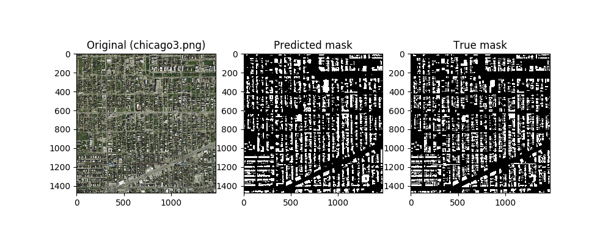
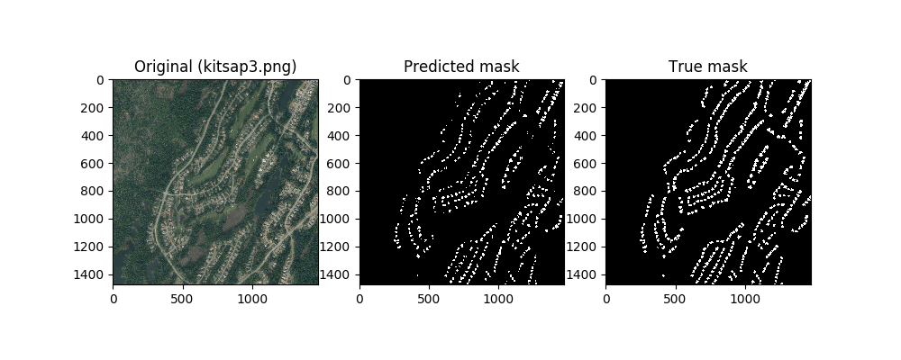
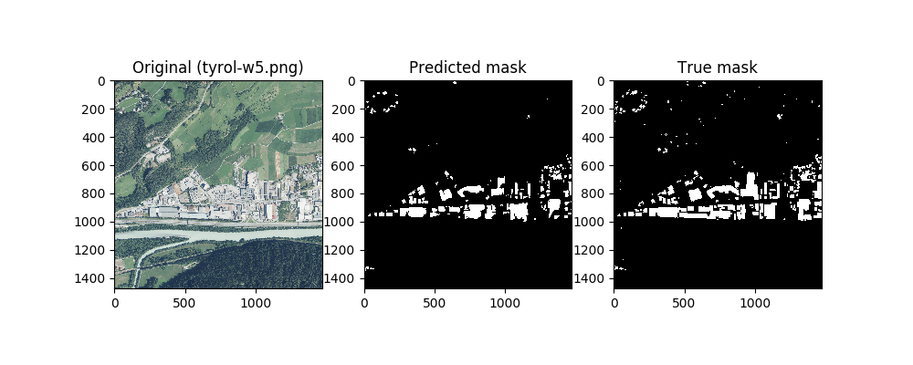
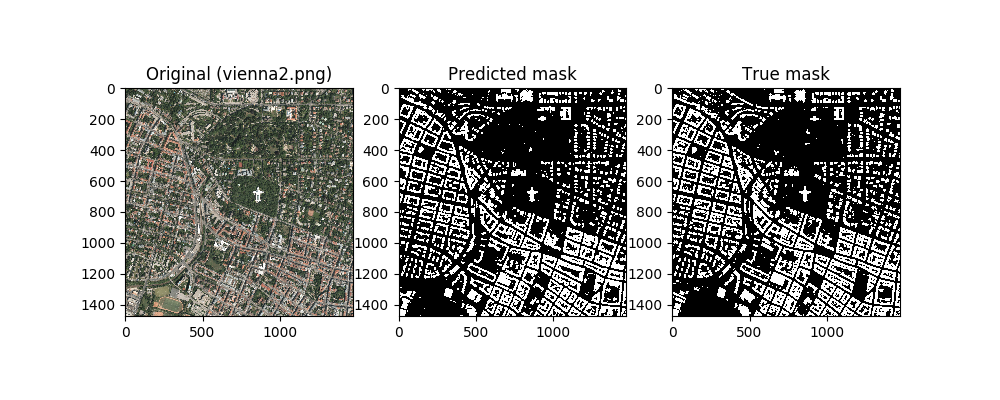

Satellite House Detection
==============================

In this project I'm training neural network to detect houses on the satellite images. 

## Data
Satellite images are provided by [Inria Aerial Image Labeling Dataset](https://project.inria.fr/aerialimagelabeling/).  
This dataset contains both RGB images of different cities and masks showing location of the man-made structures.  
For this project images used for competition testing were discarded and instead training images were divided into following categories:  
 - test: 5 images from each of 5 cities (25 images total)
 - val: 30% of the remaining images were set aside for validation purposes during training
 - train: remaining 110 images were used for training  
 
All images were resized to 1500x1500px.

Also samples for training were augmented using [albumentations library](https://github.com/albumentations-team/albumentations)

## Model
For this project model was build based on U-Net neural network architecture.  

## Results
After successfully training the model it was able to show some promising results some of which are presented below.  
  
  
  
  

## Execution
To reproduce my results follow these steps:  
 - install python3
 - install CUDA, CuDNN if you have graphics card for faster calculations;
 - install python requirements by running `make requirements`
 - run modeling pipeline by executing `make pipeline`
 
 To run modeling steps independently refer to list of _make_ commands by executing `make`.

## Project Organization

    ├── LICENSE
    ├── Makefile           <- Makefile with commands like `make data` or `make train`
    ├── README.md          <- The top-level README for developers using this project.
    ├── data
    │   ├── predicted      <- Saved outputs of the neural network.
    │   ├── processed      <- The final, canonical data sets for modeling.
    │   └── raw            <- The original, immutable data dump.
    │
    ├── models             <- Trained and serialized models (not versioned)
    │
    ├── notebooks          <- Jupyter notebooks.
    │
    ├── reports            <- Generated analysis as HTML, PDF, LaTeX, etc.
    │   ├── predictions    <- Generated figures demonstrating project results.
    │   └── figures        <- Generated graphics and figures to be used in reporting
    │
    ├── requirements.txt   <- The requirements file for reproducing the analysis environment, e.g.
    │                         generated with `pip freeze > requirements.txt`
    │
    └── src                <- Source code for use in this project.
        ├── __init__.py    <- Makes src a Python module
        │
        ├── data           <- Scripts to download or generate data
        │   └── download_data.sh
        │   └── make_dataset.py
        │
        └── models         <- Scripts to train models and then use trained models to make
            │                 predictions
            ├── augmentations.py
            ├── generators.py
            ├── predict_model.py
            └── train_model.py

